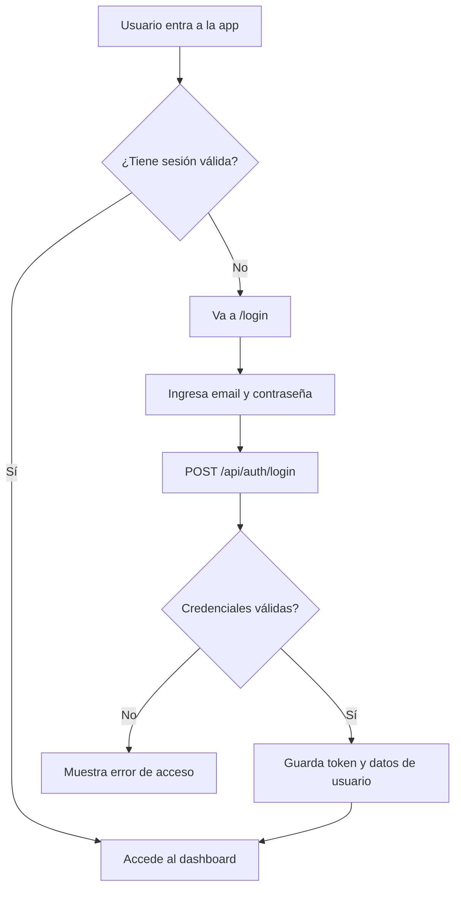
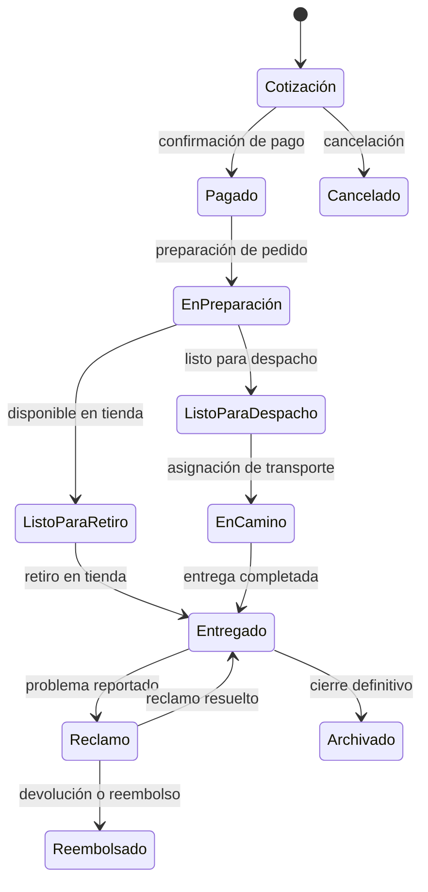

# Flujo de la Aplicación - Radar V3

Este documento describe los flujos principales de navegación y negocio del nuevo proyecto Radar V3 para que el desarrollo local avance con una visión clara.

---

## 1. Mapa de rutas del frontend

```text
/                     # landing / acceso general
/login                # inicio de sesión
/dashboard            # resumen del negocio
/orders               # gestión de órdenes
/customers           # directorio de clientes
/invoices            # facturación y pagos
/claims              # reclamos
/warranties          # garantías
/notifications       # alertas operativas
/calls               # operaciones de atención al cliente
/deliveries          # entregas y retiros
/logistics           # logística interna
/users               # administración de usuarios
/system-admin        # configuración y diagnóstico del sistema
/track/:id           # seguimiento público de orden
```

---

## 2. Flujo principal de autenticación



---

## 3. Ciclo de vida de una orden



---

## 4. Flujo de operación diaria

### 4.1. Crear y gestionar una orden

1. El vendedor crea la orden.
2. El sistema guarda datos del cliente, vehículo y monto.
3. El operador actualiza estado según el avance.
4. El sistema registra historial y notificaciones.

### 4.2. Atención al cliente

1. El operador revisa una orden.
2. Registra contacto con el cliente.
3. Guarda motivo, resultado y próxima acción.
4. El sistema deja evidencia del seguimiento.

### 4.3. Seguimiento público

1. El cliente usa un enlace o número de orden.
2. El sistema muestra el estado actual.
3. El cliente puede ver el avance del pedido sin entrar al panel interno.

---

## 5. Reglas de flujo para Radar V3

- Todo cambio de estado debe quedar registrado.
- Cada orden debe poder mostrar su historial.
- Las notificaciones deben ser visibles desde el panel operativo.
- El sistema debe ser claro para operar en tiempo real sin mucha capacitación.

Este flujo debe guiar el desarrollo inicial para que el producto se vea útil desde el primer sprint.
